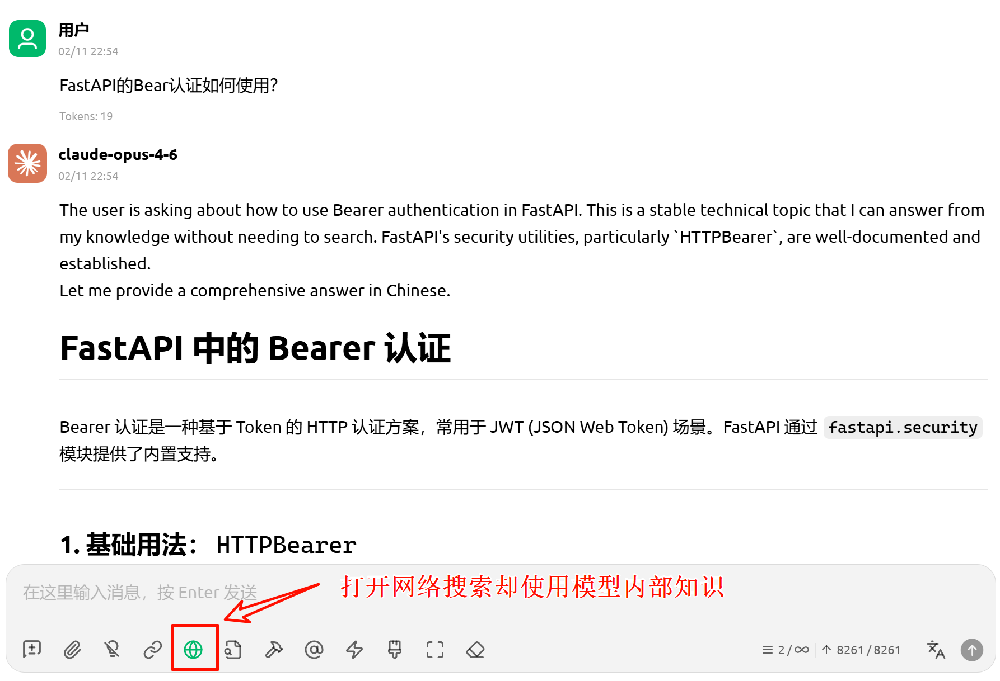
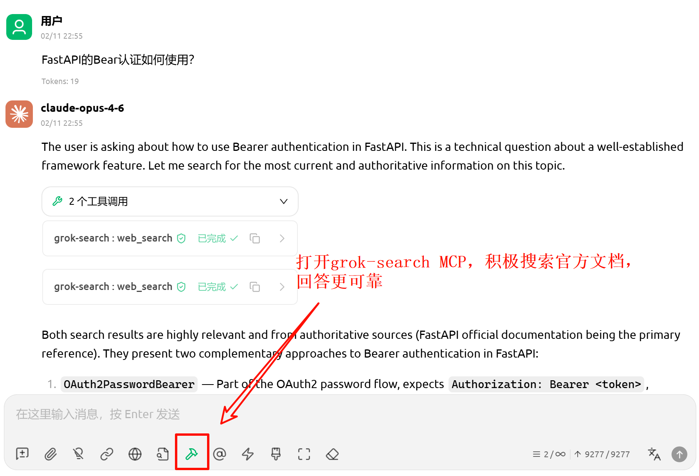

<div align="center">

<!-- # Grok Search MCP -->

[English](./docs/README_EN.md) | 简体中文

**Grok-with-Tavily MCP，为 Claude Code 提供更完善的网络访问能力**

[](https://opensource.org/licenses/MIT) [](https://www.python.org/downloads/) [](https://github.com/jlowin/fastmcp)

</div>

---

## 一、概述

Grok Search MCP 是一个基于 [FastMCP](https://github.com/jlowin/fastmcp) 构建的 MCP 服务器，采用**双引擎架构**：**Grok** 负责 AI 驱动的智能搜索，**Tavily** 负责高保真网页抓取与站点映射，各取所长为 Claude Code / Cherry Studio 等LLM Client提供完整的实时网络访问能力。

```
Claude ──MCP──► Grok Search Server
                  ├─ web_search  ───► Grok API（AI 搜索）
                  ├─ web_fetch   ───► Tavily Extract → Firecrawl Scrape（内容抓取，自动降级）
                  └─ web_map     ───► Tavily Map（站点映射）
```

### 功能特性

- **双引擎**：Grok 搜索 + Tavily 抓取/映射，互补协作
- **Firecrawl 托底**：Tavily 提取失败时自动降级到 Firecrawl Scrape，支持空内容自动重试
- **OpenAI 兼容接口**，支持任意 Grok 镜像站
- **自动时间注入**（检测时间相关查询，注入本地时间上下文）
- 一键禁用 Claude Code 官方 WebSearch/WebFetch，强制路由到本工具
- 智能重试（支持 Retry-After 头解析 + 指数退避）
- 父进程监控（Windows 下自动检测父进程退出，防止僵尸进程）

### 效果展示
我们以在`cherry studio`中配置本MCP为例，展示了`claude-opus-4.6`模型如何通过本项目实现外部知识搜集，降低幻觉率。

如上图，**为公平实验，我们打开了claude模型内置的搜索工具**，然而opus 4.6仍然相信自己的内部常识，不查询FastAPI的官方文档，以获取最新示例。

如上图，当打开`grok-search MCP`时，在相同的实验条件下，opus 4.6主动调用多次搜索，以**获取官方文档，回答更可靠。** 


## 二、安装

### 前置条件

- Python 3.10+
- [uv](https://docs.astral.sh/uv/getting-started/installation/)（推荐的 Python 包管理器）
- Claude Code

<details>
<summary><b>安装 uv</b></summary>

```bash
# Linux/macOS
curl -LsSf https://astral.sh/uv/install.sh | sh

# Windows PowerShell
powershell -ExecutionPolicy ByPass -c "irm https://astral.sh/uv/install.ps1 | iex"
```

> Windows 用户**强烈推荐**在 WSL 中运行本项目。

</details>

### 一键安装
若之前安装过本项目，使用以下命令卸载旧版MCP。
```
claude mcp remove grok-search
```


将以下命令中的环境变量替换为你自己的值后执行。Grok 接口需为 OpenAI 兼容格式；Tavily 为可选配置，未配置时工具 `web_fetch` 和 `web_map` 不可用。

```bash
claude mcp add-json grok-search --scope user '{
  "type": "stdio",
  "command": "uvx",
  "args": [
    "--from",
    "git+https://github.com/fcki1984/GrokSearch@main",
    "grok-search"
  ],
  "env": {
    "GROK_API_URL": "https://your-api-endpoint.com/v1",
    "GROK_API_KEY": "your-grok-api-key",
    "TAVILY_API_KEY": "tvly-your-tavily-key",
    "TAVILY_API_URL": "https://api.tavily.com"
  }
}'
```

<details> <summary>如果遇到 SSL / 证书验证错误</summary>

在部分企业网络或代理环境中，可能会出现类似错误：

certificate verify failed
self signed certificate in certificate chain

可以在 uvx 参数中添加 --native-tls，使其使用系统证书库：

claude mcp add-json grok-search --scope user '{
  "type": "stdio",
  "command": "uvx",
  "args": [
    "--native-tls",
    "--from",
    "git+https://github.com/fcki1984/GrokSearch@main",
    "grok-search"
  ],
  "env": {
    "GROK_API_URL": "https://your-api-endpoint.com/v1",
    "GROK_API_KEY": "your-grok-api-key",
    "TAVILY_API_KEY": "tvly-your-tavily-key",
    "TAVILY_API_URL": "https://api.tavily.com"
  }
}'
</details> ```

除此之外，你还可以在`env`字段中配置更多环境变量

| 变量 | 必填 | 默认值 | 说明 |
|------|------|--------|------|
| `GROK_API_URL` | ✅ | - | Grok API 地址（OpenAI 兼容格式） |
| `GROK_API_KEY` | ✅ | - | Grok API 密钥 |
| `GROK_MODEL` | ❌ | `grok-4-fast` | 默认模型（设置后优先于 `~/.config/grok-search/config.json`） |
| `TAVILY_API_KEY` | ❌ | - | Tavily API 密钥（用于 web_fetch / web_map） |
| `TAVILY_API_URL` | ❌ | `https://api.tavily.com` | Tavily API 地址 |
| `TAVILY_ENABLED` | ❌ | `true` | 是否启用 Tavily |
| `FIRECRAWL_API_KEY` | ❌ | - | Firecrawl API 密钥（Tavily 失败时托底） |
| `FIRECRAWL_API_URL` | ❌ | `https://api.firecrawl.dev/v2` | Firecrawl API 地址 |
| `GROK_DEBUG` | ❌ | `false` | 调试模式 |
| `GROK_LOG_LEVEL` | ❌ | `INFO` | 日志级别 |
| `GROK_LOG_DIR` | ❌ | `logs` | 日志目录 |
| `GROK_RETRY_MAX_ATTEMPTS` | ❌ | `3` | 最大重试次数 |
| `GROK_RETRY_MULTIPLIER` | ❌ | `1` | 重试退避乘数 |
| `GROK_RETRY_MAX_WAIT` | ❌ | `10` | 重试最大等待秒数 |


### 验证安装

```bash
claude mcp list
```

🍟 显示连接成功后，我们**十分推荐**在 Claude 对话中输入 
```
调用 grok-search toggle_builtin_tools，关闭Claude Code's built-in WebSearch and WebFetch tools
```
工具将自动修改**项目级** `.claude/settings.json` 的 `permissions.deny`，一键禁用 Claude Code 官方的 WebSearch 和 WebFetch，从而迫使claude code调用本项目实现搜索！


## 三、MCP 工具介绍

<details>
<summary>本项目提供七个 MCP 工具（展开查看）</summary>

### `web_search` — AI 网络搜索

通过 Grok API 执行 AI 驱动的网络搜索。该工具仍要求配置 Grok，并会先完成本地配置和模型校验。

`web_search` 不在响应内展开信源；成功的结构化响应返回 `session_id`、`content`、`sources_count` 和 `content_source`。信源会按 `session_id` 缓存在服务端，可用 `get_sources` 拉取。

当 Tavily 已启用并配置 API key 时，每个通过本地校验的请求都会把一次 Tavily Search 作为备用，与唯一一次 Grok Search 并发启动，而不是等待 Grok 失败后再调用。该请求的 `max_results` 至少为 5；`extra_sources` 配额更大时会请求更多候选。`extra_sources` 仍只控制 Grok 成功路径公开和缓存的 Tavily/Firecrawl 补充信源，以及既有 Firecrawl 分配。

非空 Grok 回答始终优先。若 Grok 返回空白、达到自身 30 秒完整操作上限，或发生上游 HTTP/传输错误，工具会使用并发请求中已完成且可用的完整 Tavily Search 备用结果。回退正文会明确标注 `Tavily search fallback` 和 `Untrusted search excerpts, not a Grok-generated answer`，它不是 Grok 生成或综合的回答。`sources_count` 和 `get_sources` 仍只反映 `extra_sources` 配额选中的补充信源；`extra_sources=0` 时备用结果不会公开或缓存。若 Tavily 未启用、未配置或没有可用结果，工具会明确失败，不会成功返回空白正文。

| 参数 | 类型 | 必填 | 默认值 | 说明 |
|------|------|------|--------|------|
| `query` | string | ✅ | - | 搜索查询语句 |
| `platform` | string | ❌ | `""` | 聚焦平台（如 `"Twitter"`, `"GitHub, Reddit"`） |
| `model` | string | ❌ | `null` | 按次指定 Grok 模型 ID |
| `extra_sources` | int | ❌ | `0` | Grok 成功路径公开和缓存的 Tavily/Firecrawl 补充信源数量；`0` 不关闭已配置的 Tavily 备用请求 |

自动检测查询中的时间相关关键词（如"最新""今天""recent"等），注入本地时间上下文以提升时效性搜索的准确度。

返回值（结构化字典）：
- `session_id`: 本次查询的会话 ID
- `content`: Grok 回答正文或已标注的 Tavily Search 回退摘录
- `sources_count`: 已缓存的信源数量
- `content_source`: 正文来源，值严格为 `grok` 或 `tavily_search_fallback`

以上字段适用于提供方请求成功的响应；请求提供方前的配置或模型校验错误仍按原有错误对象返回。Grok Search 和 Tavily Search 均有 30 秒完整操作上限，但这不是 `web_search` 端到端 SLA：可选的未缓存模型校验可能增加耗时，Firecrawl 使用既有独立时序，两者均配置时现有分配还可能等待 Firecrawl。该路径不重试 Grok，每次最多发起一次 Tavily Search，不自动调用 Tavily Extract，也不重新分配补充信源配额。

### `get_sources` — 获取信源

通过 `session_id` 获取对应 `web_search` 的全部信源。

| 参数 | 类型 | 必填 | 说明 |
|------|------|------|------|
| `session_id` | string | ✅ | `web_search` 返回的 `session_id` |

返回值（结构化字典）：
- `session_id`
- `sources_count`
- `sources`: 信源列表（每项包含 `url`，可能包含 `title`/`description`/`provider`）

### `web_fetch` — 网页内容抓取

通过 Tavily Extract API 获取完整网页内容，返回 Markdown 格式。Tavily Extract 的完整操作上限为 30 秒；失败后仍按原有行为降级到 Firecrawl Scrape，Firecrawl 使用其独立时序。

| 参数 | 类型 | 必填 | 说明 |
|------|------|------|------|
| `url` | string | ✅ | 目标网页 URL |

### `web_map` — 站点结构映射

通过 Tavily Map API 遍历网站结构，发现 URL 并生成站点地图。

| 参数 | 类型 | 必填 | 默认值 | 说明 |
|------|------|------|--------|------|
| `url` | string | ✅ | - | 起始 URL |
| `instructions` | string | ❌ | `""` | 自然语言过滤指令 |
| `max_depth` | int | ❌ | `1` | 最大遍历深度（1-5） |
| `max_breadth` | int | ❌ | `20` | 每页最大跟踪链接数（1-500） |
| `limit` | int | ❌ | `50` | 总链接处理数上限（1-500） |
| `timeout` | int | ❌ | `150` | 超时秒数（10-150） |

`timeout` 的公开默认值和可接受范围仍为 150 秒及 10-150 秒；Tavily Map 的实际完整操作上限为 `min(timeout, 30)` 秒。

### `get_config_info` — 配置诊断

无需参数。显示所有配置状态、测试 Grok API 连接、返回响应时间和可用模型列表（API Key 自动脱敏）。

### `switch_model` — 模型切换

| 参数 | 类型 | 必填 | 说明 |
|------|------|------|------|
| `model` | string | ✅ | 模型 ID（如 `"grok-4-fast"`, `"grok-2-latest"`） |

切换后配置持久化到 `~/.config/grok-search/config.json`，跨会话保持。

### `toggle_builtin_tools` — 工具路由控制

| 参数 | 类型 | 必填 | 默认值 | 说明 |
|------|------|------|--------|------|
| `action` | string | ❌ | `"status"` | `"on"` 禁用官方工具 / `"off"` 启用官方工具 / `"status"` 查看状态 |

修改项目级 `.claude/settings.json` 的 `permissions.deny`，一键禁用 Claude Code 官方的 WebSearch 和 WebFetch。

### 直接搜索

直接调用 `web_search` 执行搜索；需要聚焦特定网站时传入 `platform`，需要查看信源时再用返回的 `session_id` 调用 `get_sources`。
</details>

## 四、常见问题

<details>
<summary>
Q: 必须同时配置 Grok 和 Tavily 吗？
</summary>
A: Grok（`GROK_API_URL` + `GROK_API_KEY`）仍为 `web_search` 必填项。Tavily 和 Firecrawl 均为可选；Tavily 启用并配置后，每个通过本地校验的 `web_search` 都会并发发起一次备用 Search。`extra_sources` 只控制 Grok 成功路径公开和缓存的补充信源及 Firecrawl 分配；两者都配置时补充配额仍全部分给 Firecrawl，但 Tavily 备用回退仍可用。`web_fetch` 优先使用 Tavily Extract，失败时可降级到 Firecrawl Scrape；两者均未配置时返回配置错误。`web_map` 依赖 Tavily。
</details>

<details>
<summary>
Q: Grok API 地址需要什么格式？
</summary>
A: 需要 OpenAI 兼容格式的 API 地址（支持 `/chat/completions` 和 `/models` 端点）。如使用官方 Grok，需通过兼容 OpenAI 格式的镜像站访问。
</details>

<details>
<summary>
Q: 如何验证配置？
</summary>
A: 在 Claude 对话中说"显示 grok-search 配置信息"，将自动测试 API 连接并显示结果。
</details>

## 许可证

[MIT License](LICENSE)

---

<div align="center">

**如果这个项目对您有帮助，请给个 Star！**

[](https://www.star-history.com/#GuDaStudio/GrokSearch&type=date&legend=top-left)
</div>
